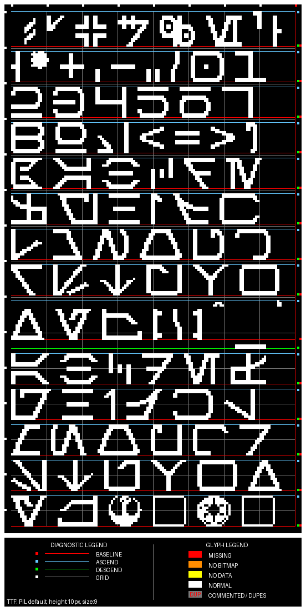
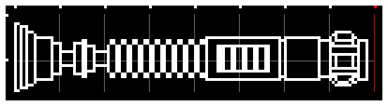

# Glyphy is a CLI Python script based project that renders & analyses ProffieOS .h text font files.

It generates: 
- A visual preview image (.bmp, .png or .jpg) 
- A detailed analysis report (optional with `GENERATE_REPORT = True`)

## Glyphy's Missions:

1. Visualizer: 
Render everything drawable from a ProffieOS .h text font file. 
  Glyphy will show you every duplicate, every forgotten commented ghosts. 
  You can have as many bitmap arrays and/or GLYPHDATA as you like, 
  Glyphy will show them all. 
  Glyphy will even show you what is "not there" with color coded glyphs: 
  - Yellow: missing GLYPHDATA
  - Orange: missing bitmap arrays / empty bitmap arrays
  - Red:    missing both
  - Grey:   duplicates 
  Labels follow the same logic except if a duplicate is not commented, then it will be Red

2. Validator: 
The validator reports many deviations. 
  For example: incorrect uintXX_t number, missing bitmap array / GLYPHDA / both 
  Several "deviations" are for information only, some glyphs are designed to "move weirdly" (many in the case of StarJedi10Font.h)

3. Limited Repair System: 
Provide automated tools to repair structural or cosmetic font issues. 
  For example: fix incorrect uintXX_t numbers, add ASCII comments for each bitmap array and GLYPHDATA 
  - Glyphy cannot generate missing "glyph-art"
  - Glyphy will not modify the original, but will generate a repaired clone
  - Glyphy will not overwrite clones, a new clone will be created

## Rendered Examples: 
StarJedi10Font.h, `RENDER_MODE = "text", DISPLAY_DIAGNOSTIC = False, ROW_ALIGN = "center"` 

  

Aurebesh10Font.h, `RENDER_MODE = "table", DISPLAY_DIAGNOSTIC = True, ROW_ALIGN = "left"` 

  

saber_logo.h, `RENDER_MODE = "random",  DISPLAY_DIAGNOSTIC = True` 

  

OLED sized logo, `RENDER_MODE = "text", BLACK_AND_WHITE_ONLY = True, ROW_ALIGN = "center"` 
<table align="center">
  <tr>
    <td align="center">
      <b>INVERT_BLACK_AND_WHITE = True</b> 
      
    </td>
    <td align="center">
      <b>INVERT_BLACK_AND_WHITE = False</b> 
      
    </td>
  </tr>
</table>

## OS:
- tested on Windows
- should be compatible with:
  - macOS
  - Linux/Unix

## Requirements:

- Python 3.9 or newer
- Pillow (Python Imaging Library)

See [`InstallationGuide/InstallationGuide.md`](InstallationGuide/InstallationGuide.md) for a quick Glyphy & Python install guide.
